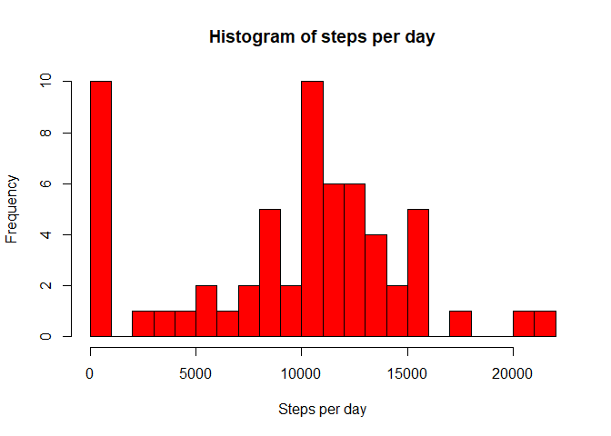
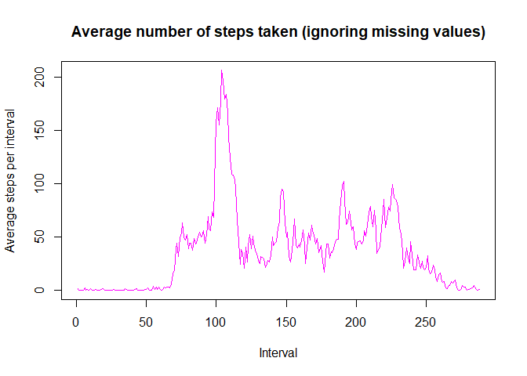

## Loading and preprocessing the data

```r
#import libraries
library(zip)
```

```
## 
## Attaching package: 'zip'
```

```
## The following object is masked from 'package:utils':
## 
##     zip
```

```r
# Disable scientific notation
options(scipen = 999)

# filenames
zipfilename <- "./activity.zip"
datafilename <- "./activity.csv"

# 1. Read dataset
if(!file.exists(datafilename)) {
    unzip(zipfilename)
}
df <- read.csv(datafilename)
df$date <- as.Date(df$date, "%Y-%m-%d")
```
## What is mean total number of steps taken per day?

```r
# 2. Histogram of the total number of steps taken each day
stepsPerDay <- tapply(X = df$step, INDEX = df$date, FUN = sum, na.rm = TRUE)
par(mfrow = c(1,1))
hist(stepsPerDay, breaks = 30, col = "red", xlab = "Steps per day", main = "Histogram of steps per day")
```

<!-- -->

## What is the average daily activity pattern?


```r
# 3. Mean and median number of steps taken each day
meanStepsPerDay <- round(mean(stepsPerDay), digits = 2)
medianStepsPerDay <- round(median(stepsPerDay), digits = 2)

# 4. Time series plot of the average number of steps taken
par(mfrow = c(1,1))
averageStepsPerInterval <- tapply(X = df$step, INDEX = df$interval, FUN = mean, na.rm = T)
plot(averageStepsPerInterval, type = "l", col="magenta", main = "Average number of steps taken (ignoring missing values)", xlab = "Interval", ylab = "Average steps per interval")
```

<!-- -->

```r
# 5. The 5-minute interval that, on average, contains the maximum number of steps
intervalWithMaxValue <- which.max(averageStepsPerInterval)
intervalMaxValue <- round(max(averageStepsPerInterval), digits = 2)
maxIntervalName <- df$interval[intervalWithMaxValue[1]]
```
The mean number of steps per day is **9354.23**.

The median number of steps per day is **10395**.

The interval that on average across all the days in the dataset, contains the maximum number of steps is the **104-th** that corresponds to interval **835** with a value of **206.17** steps per day.

## Imputing missing values


```r
# 6. Code to describe and show a strategy for imputing missing data: the mean for that 5-minute interval
numberOfNA <- sum(is.na(df$steps))
```
There are **2304** NA (missing values) in the *steps* column of the dataset.

The chosen strategy to impute a missing value is to use the mean of the corresponding 5-minute interval.

```r
# Create a new dataset that is equal to the original dataset but with the missing data filled in.
imputeddf <- df
i <- -1
imputeddf$steps <- sapply(df$steps, FUN = function(x) {
    i <<- i + 1
    if(is.na(x)) averageStepsPerInterval[[i %% 288 +1]]
    else x
}
)

imputedstepsPerDay <- tapply(X = imputeddf$step, INDEX = imputeddf$date, FUN = sum, na.rm = TRUE)
# 7. Histogram of the total number of steps taken each day after missing values are imputed. 
hist(imputedstepsPerDay, breaks = 30, col = "yellow", main = "Histogram of mean of steps per day (with imputed missing values)", xlab = "Steps")
```

<!-- -->

```r
imputedMeanStepsPerDay   <- round(mean(imputedstepsPerDay), digits = 2)
imputedMedianStepsPerDay <- round(median(imputedstepsPerDay), digits = 2)
```
The mean and median of the total number of steps taken per day after imputing the missing value increase with respect to the corresponding values calculated ignoring missing values.

```r
# Add spectacular-looking table to impress reviewer.
```
| Tables                   | mean                       | median                       |
| ------------------------ |----------------------------| -----------------------------|
| Ignoring missing values  | 9354.23        | 10395        |
| Imputing missing values  | 10766.19 | 10766.19 |


## Are there differences in activity patterns between weekdays and weekends?


```r
# Creating a new factor variable in the dataset with two levels – “weekday” and “weekend” indicating whether a given date is a weekday or weekend day.
findDayType <- function(date) {
    if(weekdays(date) == "sábado" | weekdays(date) == "domingo")
        "weekend"
    else
        "weekday"
} 
imputeddf$daytype = sapply(imputeddf$date, FUN = findDayType)

# 8. Panel plot comparing the average number of steps taken per 5-minute interval across weekdays and weekends

par(mfrow = c(2,1), mar = c(2,4,2,1))
weekdaydf <- imputeddf[imputeddf$daytype == "weekday",]
averageStepsPerIntervalWD <- tapply(X = weekdaydf$step, weekdaydf$interval, mean)
plot(averageStepsPerIntervalWD, type = "l", col = "blue", main = "Average number of steps (weekdays)",
     xlab = "Interval", ylab = "Number of steps")

weekenddf <- imputeddf[imputeddf$daytype == "weekend",]
averageStepsPerIntervalWE <- tapply(X = weekenddf$step, INDEX = weekenddf$interval, FUN = mean)
plot(averageStepsPerIntervalWE, type = "l", col = "green", main = "Average number of steps (weekends)",
     xlab = "Interval", ylab = "Number of steps")
```

<!-- -->

It is easy to see that during the weekends the mean number of steps per day is higher than on weekdays.


